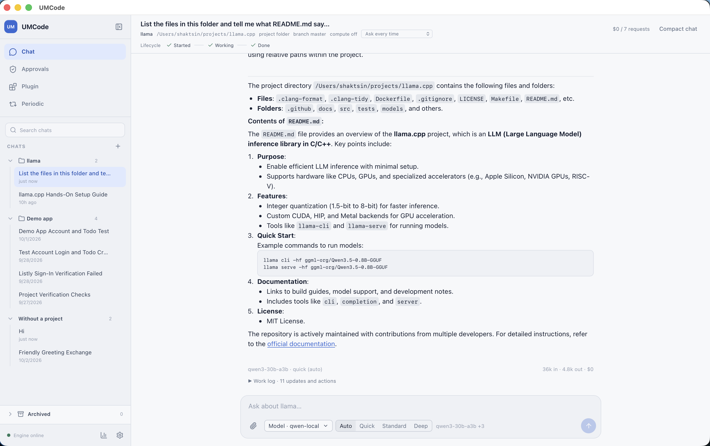

# UMCode

A local-first AI workbench for project-scoped chats and software work.

Choose a project folder and UMCode keeps its chats and project instructions together. Start a clean chat or a contextual side chat, choose configured provider/model IDs, or combine models into an ordered pool. When a provider reports a quota or rate limit, the engine can continue with the next configured model. Tool actions stay visible, with approvals for sensitive operations.



---

- **Project-aware chats** — work in a selected folder with its `AGENTS.md` or `CLAUDE.md` instructions
- **Provider and model choice** — use configured models directly or create ordered pools across providers
- **Quota-aware routing** — move to the next model in a pool when a provider reports a retryable quota or rate-limit failure
- **Local controls** — keep chat history, model settings, engine status, and approval workflows in one desktop app
- **Protected credentials** — provider API keys are stored in the macOS Keychain

---

## Build and run

Requires Go 1.24+ and, for the desktop app, Node.js. See [GO_ENGINE.md](GO_ENGINE.md) for the full guide.

```bash
make go-build                 # build the engine + CLI → bin/umcode
./bin/umcode engine         # run the engine in the foreground
make app-build                # build UMCode.app (macOS)
make help                     # list all targets
```
